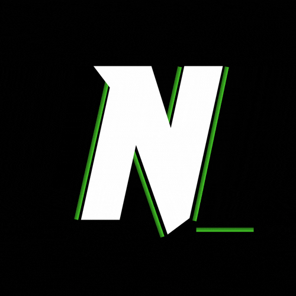

<!-- prettier-ignore -->
<div align="center">



# NexoNotes

*Sistema Autónomo y Privado de Gestión de Documentos Técnicos y Motor RAG*

[](README_en.md)
[](LICENSE.md)
[](https://www.docker.com/)
[](https://fastapi.tiangolo.com/)
[](https://github.com/pgvector/pgvector)
[](https://react.dev/)
[](https://www.typescriptlang.org/)
[](https://ai.google.dev/)

[Descripción General](#descripción-general) • [Arquitectura](#arquitectura-del-sistema) • [Puertos del Sistema](#puertos-del-sistema) • [Requisitos Previos](#requisitos-previos) • [Inicio Rápido](#inicio-rápido) • [Comandos CLI](#comandos-cli) • [Características](#características-principales) • [Manual de Usuario](#manual-de-usuario--guía-práctica) • [Referencia API](#referencia-de-la-api) • [Licencia](#licencia)

</div>

---

> [!NOTE]
> **Documentación en Inglés:** Puedes consultar la versión en inglés de esta documentación en la raíz del proyecto: [README_en.md](README_en.md).

---

## Descripción General

**NexoNotes** es un sistema autónomo y privado de gestión de documentación técnica con un motor **RAG (Retrieval-Augmented Generation)** integrado y contenerizado mediante Docker.

Diseñado específicamente para desarrolladores e ingenieros de software, NexoNotes destaca por ser una herramienta **ultrarrápida, minimalista y de alta eficiencia** con **estética de TERMINAL, CLI o IDE**. Te permite centralizar, organizar y consultar tu base de conocimiento técnica de forma instantánea, privada y sin delegar vectores a servicios en la nube de terceros.

> [!IMPORTANT]
> Todas las notas se almacenan localmente en PostgreSQL y se vectorizan automáticamente en embeddings de 768 dimensiones utilizando `pgvector`. Tus datos permanecen 100% bajo tu control y las respuestas de Nexo se generan de forma estricta a partir de tu contenido.

---

## Arquitectura del Sistema

```
[ Navegador Web ]
       │
       ▼ (Puerto 3780)
[ Frontend: React 18 + Nginx ]
       │
       ▼ (Proxy inverso interno /api/)
[ Backend: FastAPI (Python 3.11) ] ───► [ Motor IA: API Gemini ]
       │                                (text-embedding / gemini-3.5-flash-lite)
       ▼
[ Base de Datos: PostgreSQL 16 + pgvector ]
    ├── notes (id, title, content, tags, folder, created_at, updated_at)
    └── embedding (Vector 768d con índice HNSW cosine)
```

- **Base de Datos y Almacenamiento Vectorial:** PostgreSQL 16 con extensión `pgvector` e índice HNSW para búsquedas semánticas de alta velocidad.
- **Backend API:** FastAPI (Python 3.11), SQLAlchemy 2.0, Microsoft MarkItDown y transmisiones SSE en tiempo real.
- **Frontend SPA:** React 18, TypeScript y Tailwind CSS servidos por Nginx.
- **Orquestación:** Despliegue multicontenedor gestionado mediante Docker Compose.

---

## Puertos del Sistema

| Servicio | Endpoint | Descripción |
| :--- | :--- | :--- |
| **Interfaz Frontend** | `http://localhost:3780` | Panel de gestión de notas y consola Nexo |
| **Backend API** | `http://localhost:8780` | Endpoints REST y transmisión SSE |
| **Documentación API** | `http://localhost:8780/docs` | Interfaz interactiva OpenAPI / Swagger |
| **PostgreSQL** | `localhost:5432` | Base de datos relacional y almacén vectorial `pgvector` |

---

## Requisitos Previos

- **Docker Engine** 24.0+ y **Docker Compose** v2.0+
- **Clave de API de Google Gemini** (`GEMINI_API_KEY`)

---

## Inicio Rápido

### 1. Clonar el Repositorio

```bash
git clone https://github.com/carlosNahuelSanchez/NexoNotes.git
cd NexoNotes
```

### 2. Configurar Variables de Entorno

```bash
cp .env.example .env
```

*(En Windows PowerShell: `Copy-Item .env.example .env`)*

Edita el archivo `.env` e ingresa tu clave de API de Google Gemini:

```env
GEMINI_API_KEY=tu_clave_real_de_gemini
POSTGRES_DB=nexonotes_db
POSTGRES_USER=nexonotes_admin
POSTGRES_PASSWORD=nexonotes_secure_pass
POSTGRES_PORT=5432
BACKEND_PORT=8780
FRONTEND_PORT=3780
LLM_MODEL=gemini-3.5-flash-lite
```

### 3. Registrar el Comando Global CLI

```bash
# Linux / macOS / Git Bash:
./nexonotes install

# Windows PowerShell:
.\nexonotes.ps1 install
```

### 4. Iniciar el Sistema

```bash
nexonotes start
```

Accede a la interfaz web en **`http://localhost:3780`**.

---

## Comandos CLI

| Comando | Descripción |
| :--- | :--- |
| `nexonotes start` | Compila imágenes e inicia contenedores en segundo plano |
| `nexonotes stop` | Detiene contenedores de forma limpia conservando el volumen de datos |
| `nexonotes logs` | Transmite los logs combinados en tiempo real |
| `nexonotes install` | Configura el ejecutable globalmente en el sistema |

---

## Características Principales

- **Explorador Jerárquico & Drag & Drop:** Árbol de archivos real estilo IDE con soporte para arrastrar notas y carpetas (incluyendo soltar en la raíz `/` o desde el explorador del sistema operativo).
- **Gestión & Edición Completa:** Creación, eliminación, copia/pegado y renombrado de notas y carpetas en tiempo real (`Alt+R` o menú contextual `...`) con persistencia en la base de datos.
- **Búsqueda & Filtro de Etiquetas:** Búsqueda autónoma por título, contenido y múltiples etiquetas (`#etiqueta`) con apertura automática de carpetas coincidentes.
- **Editor & Lectura Markdown:** Visualización a pantalla completa, editor interactivo con vista previa y renderizado de código y fórmulas LaTeX.
- **Importación Inteligente (MarkItDown):** Soporte para archivos `.md`, `.txt`, Word (`.docx`), PDF (`.pdf`) y `.zip` con conversión automatizada a Markdown mediante Microsoft MarkItDown.
- **Consola IA Nexo (RAG Local):** Respuestas generadas en tiempo real token por token vía SSE, fundamentadas con citas directas `[Fuente: Título (ID)]` sobre vectores en `pgvector`.
- **Barra de Estado & Atajos Globales:** Mensajes del sistema con código de color (`[SYSTEM]`) y atajos de teclado (`F1`, `F2`, `Alt+N`, `Alt+F`, `Alt+R`, `Supr`, `Ctrl+C`/`Ctrl+V`).

---

## Manual de Usuario / Guía Práctica

### 1. Navegación y Gestión de Archivos
- **Creación:** Utiliza los botones `+ NOTA` y `+ CARPETA` o los atajos `Alt+N` y `Alt+F`.
- **Renombrado:** Selecciona una nota o carpeta y presiona `Alt+R` o usa el menú contextual `...`.
- **Búsqueda:** Escribe cualquier término en el buscador; las carpetas con coincidencias se desplegarán automáticamente.
- **Portapapeles:** Usa `Ctrl+C` para copiar y `Ctrl+V` para pegar archivos o carpetas.

### 2. Importación y Conversión
- Haz clic en el botón de importación en la barra superior o arrastra archivos directamente desde tu equipo.
- Si importas PDF o Word, **Microsoft MarkItDown** los convertirá automáticamente a Markdown.

### 3. Asistente Nexo
- Accede a la pestaña `[2] CONSOLA NEXO`.
- Realiza consultas técnicas para obtener respuestas generadas a partir de tus notas con citas explícitas.

---

## Referencia de la API

| Método | Endpoint | Descripción |
| :--- | :--- | :--- |
| `GET` | `/health` | Estado del sistema (PostgreSQL, Gemini IA y total de notas) |
| `GET` | `/api/notes` | Listado de notas con filtros de `search`, `tag` y `folder` |
| `POST` | `/api/notes` | Creación de nota con indexación inmediata en `pgvector` |
| `POST` | `/api/notes/import` | Importa y convierte archivos `.md`, Word, PDF y ZIP a Markdown |
| `GET` | `/api/notes/{id}/export` | Descarga la nota en formato Markdown (`.md`) |
| `GET` | `/api/notes/export/folder` | Exporta carpetas o el workspace completo en `.zip` |
| `PUT` | `/api/notes/{id}` | Actualización de nota y regeneración de vector |
| `PUT` | `/api/notes/folder/rename` | Renombra una carpeta y actualiza las rutas de sus notas en PostgreSQL |
| `DELETE` | `/api/notes/{id}` | Eliminación de nota e índice vectorial |
| `DELETE` | `/api/notes/folder` | Elimina una carpeta completa con sus notas y subcarpetas |
| `GET` | `/api/notes/folders` | Lista de carpetas activas |
| `GET` | `/api/notes/tags` | Lista de etiquetas registradas |
| `GET` | `/api/nexo/stream` | Transmisión en tiempo real de respuestas RAG vía SSE |

---

## Estructura del Proyecto

```
NexoNotes/
├── LICENSE.md            # Licencia PolyForm Noncommercial 1.0.0
├── .env.example          # Plantilla de variables de entorno
├── docker-compose.yml    # Orquestación multicontenedor (db, backend, frontend)
├── nexonotes             # Script ejecutable CLI para Linux / macOS / Git Bash
├── nexonotes.ps1         # Script ejecutable CLI para Windows PowerShell
├── nexonotes.cmd         # Lanzador ejecutable para Windows CMD
├── README.md             # Documentación principal en Español
├── README_en.md          # Documentación en Inglés
├── backend/              # Servicio FastAPI con pgvector, MarkItDown y pipeline RAG
└── frontend/             # SPA React + TypeScript servida por Nginx
```

---

## Licencia

Este proyecto es software libre y de código abierto bajo los términos de la licencia **[PolyForm Noncommercial License 1.0.0](LICENSE.md)**.

- **Uso Permitido:** Eres libre de descargar, compilar, estudiar, modificar, adaptar y distribuir este proyecto para fines personales, educativos, de investigación o de gestión interna.
- **Restricción Comercial:** Queda estrictamente prohibido vender, sublicenciar, revender o comercializar este software o sus derivados como un producto o servicio de venta cerrado con fines de lucro comercial directo.

---

## Apoyo al Proyecto

Si **NexoNotes** te resulta de utilidad para estructurar tu conocimiento técnico y acelerar tus flujos de trabajo mediante RAG local y privado, considera apoyar el desarrollo continuo y el lanzamiento de futuras herramientas de código abierto.

<div align="center">

<a href="https://www.buymeacoffee.com/carlosNahuelSanchez" target="_blank">
  
</a>

</div>

---

<div align="center">

Hecho por el equipo de **[Nexus Studio](https://www.instagram.com/nexus.studio.dev/)**

</div>
